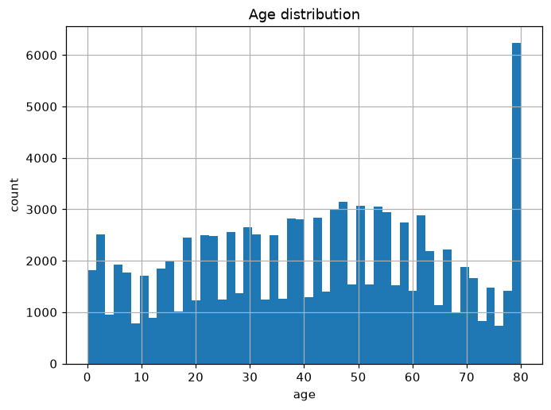
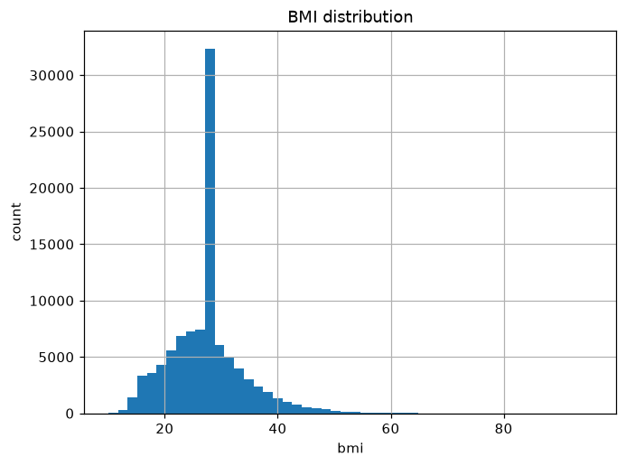
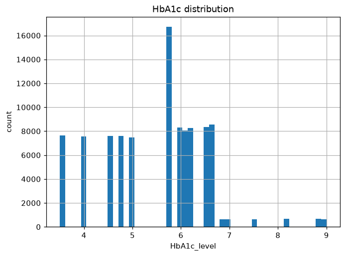
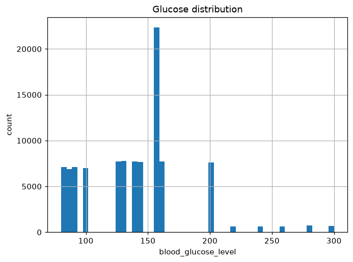
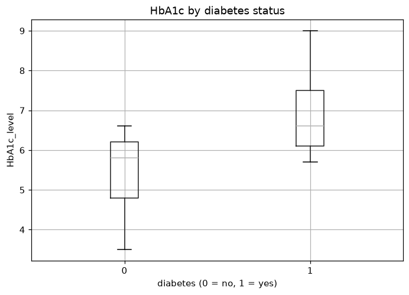
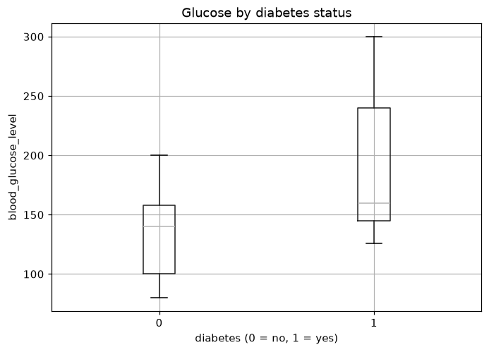
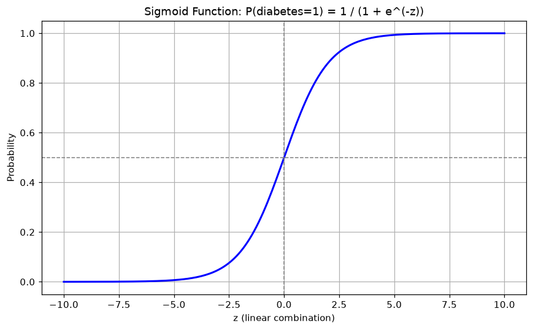
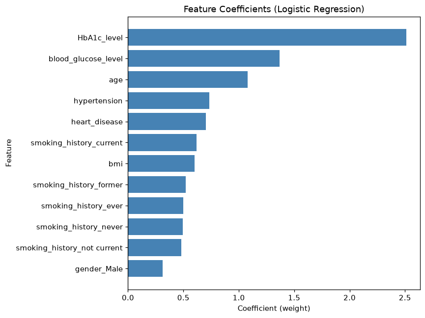

# Diabetes Prediction with Logistic Regression

A binary classification project that predicts whether a patient has diabetes from routine clinical
and demographic measurements. The emphasis of this project is on **auditing the dataset before
trusting it** — most of the work here went into understanding what the data actually contains,
not into chasing a higher accuracy score.

---

## Dataset

| | |
|---|---|
| **Source** | [Diabetes Prediction Dataset](https://www.kaggle.com/datasets/iammustafatz/diabetes-prediction-dataset) (Kaggle, Mohammed Mustafa) |
| **Size** | 100,000 rows × 9 columns |
| **Target** | `diabetes` (0 = no, 1 = yes) |
| **Class balance** | 8.5% positive — an imbalanced dataset |

**Features:** `gender`, `age`, `hypertension`, `heart_disease`, `smoking_history`, `bmi`,
`HbA1c_level`, `blood_glucose_level`

---

## Project Workflow

The project runs in three stages: **Data Quality Audit → Preprocessing → Model Building**.

### 1. Data Quality Audit

`df.isnull().sum()` returned zero missing values across every column. That result is the reason
this stage exists at all: a clean-looking dataset is not the same as a clean dataset, so each
column was checked against what its values should plausibly look like in the real world. Four
problems surfaced.

#### Duplicate rows — 3,854 records (3.9%)

Sorting the duplicated rows side by side showed they were exact copies across all nine columns.
With continuous fields like `bmi` and `age` in the mix, two patients matching on every single
value is far more likely to be a data-collection artifact than a genuine coincidence. Left in
place, these rows would leak between the train and test splits and inflate the reported score.

#### Disguised missing values

Two columns encode "unknown" as if it were real data:

**`smoking_history` — the `"No Info"` category (35,816 rows, 35.8%).**
This is a missing value wearing a category label. Two pieces of evidence confirm it is not a
meaningful group:

- The mean age of the `"No Info"` group is **33.5 years**, against 43.9–57.1 for every other
  smoking category. That is a data-collection pattern, not a biological one — younger patients
  are simply less likely to have had a smoking history recorded.
- Its diabetes rate is **4.1%**, roughly half the 8.5% base rate, and lower than every other
  category. A genuine risk group does not behave like this; a group of under-documented, younger
  patients does.

**`bmi` — the pre-imputed value 27.32 (25,495 rows, 25.5%).**
A single BMI value appearing in a quarter of a 100,000-row dataset cannot be natural variation.
27.32 is also the exact mean and median of the column, which is the fingerprint of mean-imputation
applied before the dataset was published. The decisive evidence:

- **386 children under 3 years old carry a BMI of 27.32** (11.7% of that age group). A toddler
  cannot have an adult overweight BMI — this value was filled in, not measured.
- It accounts for **26.9% of adults**, so the imputation was applied broadly across the dataset.

#### Top-coded age

`age` maxes out at exactly 80, and **5,621 patients (5.6%) sit on that single value**. This is
top-coding: everyone above 80 was collapsed into an 80 bucket, most likely for anonymization.
It is not an error to fix, but it does mean the model cannot distinguish an 81-year-old from a
95-year-old, and any age effect at the upper end is compressed.

#### Outlier analysis

The IQR rule (1.5 × IQR) flagged values in three columns. Rather than removing them on sight,
each flagged group was checked against the target:

| Column | Flagged | Diabetes rate among flagged |
|---|---|---|
| `HbA1c_level` | 1,312 | **100%** |
| `blood_glucose_level` | 2,031 | **100%** |
| `bmi` | 5,354 | 23.7% (vs. 8.5% base rate) |

Every single HbA1c and glucose outlier belongs to a diabetic patient. These are not measurement
errors — they are the clinical signal the model exists to detect. Dropping them would have deleted
the most informative rows in the dataset. The BMI outliers show a diabetes rate nearly 3× the base
rate, which is also consistent with real risk rather than noise. **No outliers were removed.**

This is the central lesson of the audit: a statistical rule flags values, but only domain context
decides whether they are errors.

---

### 2. Preprocessing

Decisions made, and the reasoning behind each:

| Decision | Reasoning |
|---|---|
| Dropped 3,854 duplicate rows | Prevents train/test leakage and score inflation |
| Dropped 18 `gender == "Other"` rows | Too few to learn from; would produce an unreliable dummy variable |
| **Kept** `"No Info"` and `bmi == 27.32` | Documented, not silently dropped — see trade-off below |
| **Kept** all outliers | Confirmed as clinical signal, not error |
| One-hot encoded `gender`, `smoking_history` (`drop_first=True`) | Converts categories to numeric without introducing collinearity |
| Standard-scaled the 4 numeric columns | Puts coefficients on a comparable scale so they can be compared directly |
| 80/20 stratified split | Preserves the 8.5% positive rate in both train and test sets |

**Final dataset: 96,128 rows** (from 100,000).

**The trade-off on the disguised missing values.** The imputed BMI values and the `"No Info"`
category were identified but deliberately left in. Removing them would have cost roughly a
quarter and a third of the dataset respectively, and imputing them again would only layer a
second guess on top of someone else's. Keeping them is the defensible choice here, but it comes
with a real cost: the BMI coefficient is diluted, because a quarter of that column carries no
patient-specific information. The number to distrust in the results below is the BMI weight.

**Note on scaling order.** The scaler is fitted on the training set only and then applied to the
test set, so no information from the test set influences the transformation.

---

### 3. Exploratory Visualizations

**Age distribution** — broadly spread across adulthood, with the visible spike at 80 caused by
top-coding.



**BMI distribution** — the dominant spike at 27.32 is the imputed value, not a natural mode.



**HbA1c and blood glucose distributions** — both are strikingly discrete, with only 18 unique
values each. Real lab measurements are continuous; this points to a synthetic or heavily rounded
dataset, which is worth stating openly about any results obtained from it.





**HbA1c and glucose by diabetes status** — the clearest separation in the dataset. Diabetic
patients sit in a distinctly higher band on both measures, which anticipates the two strongest
model coefficients.





---

## Model

**Logistic Regression** (scikit-learn), chosen because the goal is an interpretable baseline. It
outputs a calibrated probability rather than a bare label, and its coefficients can be read
directly as the direction and strength of each feature's effect — which matters more for a first
project than squeezing out extra accuracy with a model that cannot be inspected.

The model passes a linear combination of the features through the sigmoid function to produce
P(diabetes = 1), then applies a 0.5 threshold to turn that probability into a prediction:



### Results

Evaluated on the held-out 20% test set (19,226 rows, 1,696 positive).
All metrics below are for **class 1 (diabetes)** — the class that matters.

| Model | Accuracy | Precision | Recall | F1 |
|---|---|---|---|---|
| Logistic Regression (base) | **0.9588** | **0.8587** | 0.6380 | **0.7321** |
| Logistic Regression (`class_weight='balanced'`) | 0.8851 | 0.4264 | **0.8762** | 0.5736 |

**Confusion matrices:**

```
Base model                        Balanced model
                Predicted                         Predicted
              0        1                        0        1
Actual  0  17352      178          Actual  0  15531     1999
        1    614     1082                  1    210     1486
```

### Interpreting the trade-off

The base model reaches 95.9% accuracy, but accuracy is a misleading headline on an imbalanced
dataset: predicting "no diabetes" for every patient would score 91.2% while being clinically
useless. The precision/recall breakdown is where the real behaviour shows.

**The base model is conservative.** When it predicts diabetes it is right 85.9% of the time, but
it only catches 63.8% of actual cases — **614 diabetic patients are missed**. The default 0.5
threshold, applied to a dataset where positives are outnumbered roughly 10:1, pushes the model
toward the majority class.

**`class_weight='balanced'` penalizes errors on the minority class more heavily**, which moves
the model in the opposite direction. Recall rises from 63.8% to 87.6% — missed cases drop from
614 to **210**. The cost is precision falling to 42.6%: false positives rise from 178 to 1,999,
so well over half of its diabetes predictions are now wrong.

**Which one is better depends entirely on the cost of each error type**, and the two errors are
not symmetric here. A false positive means a healthy patient is sent for a confirmatory blood
test — inconvenient and mildly stressful, but cheap and self-correcting. A false negative means a
diabetic patient is told they are fine and goes untreated. For a screening tool, that asymmetry
argues for the balanced model: trading 1,821 unnecessary follow-up tests for 404 additional
patients correctly identified is a trade a screening program would generally accept. The base
model would suit a context where each positive prediction triggers something expensive or
invasive.

The headline F1 favours the base model (0.7321 vs. 0.5736), which is a useful reminder that F1
weights precision and recall equally — an assumption that does not hold in a medical screening
context.

### Feature importance

Coefficients from the base model on standardized features, so magnitudes are directly comparable:



| Feature | Coefficient |
|---|---|
| `HbA1c_level` | 2.51 |
| `blood_glucose_level` | 1.37 |
| `age` | 1.08 |
| `hypertension` | 0.73 |
| `heart_disease` | 0.70 |
| `bmi` | 0.60 |
| `gender_Male` | 0.31 |

Intercept: −5.83

`HbA1c_level` dominates, at nearly twice the weight of the next feature — which is what clinical
knowledge would predict, since HbA1c reflects average blood sugar over ~3 months and is a standard
diagnostic criterion. Blood glucose and age follow. The model agreeing with domain knowledge is a
good sign that the pipeline is sound.

Two coefficients deserve caution:

- **`bmi` (0.60) is likely understated**, for the reason given in the preprocessing section — a
  quarter of that column is a single imputed value carrying no patient-specific information.
- **All `smoking_history` coefficients cluster tightly between 0.48 and 0.62**, with almost no
  spread between "current" and "never". Since the reference category absorbed by `drop_first`
  is `"No Info"`, these values largely measure *"was this patient's history recorded at all"*
  rather than *"does this patient smoke"*. They should not be read as a smoking effect.

---

## Limitations

- The dataset is very likely synthetic or heavily processed — 18 unique HbA1c values and 18 unique
  glucose values across 100,000 rows is not what real lab data looks like. Performance here should
  not be assumed to transfer to real clinical data.
- A quarter of `bmi` and a third of `smoking_history` are effectively missing, which limits what
  can be concluded from those two features.
- Only one model family was tried. A tree-based model would likely score higher, at the cost of
  the direct interpretability that motivated this project.
- The 0.5 decision threshold was left at its default. Tuning the threshold on the base model is a
  finer-grained way to navigate the precision/recall trade-off than the binary choice between
  weighted and unweighted, and is the most obvious next step.

---

## How to Run

**1. Clone the repository**

```bash
git clone https://github.com/<your-username>/diabetes-prediction-ml.git
cd diabetes-prediction-ml
```

**2. Create a virtual environment** (recommended)

```bash
python -m venv venv

# Windows
venv\Scripts\activate

# macOS / Linux
source venv/bin/activate
```

**3. Install dependencies**

```bash
pip install -r requirements.txt
```

**4. Launch the notebook**

```bash
jupyter notebook
```

Then open `diabetes-prediction-model.ipynb` and run the cells in order. The dataset is included
in the repository, so no additional download is needed.

---

## Technologies Used

| Library | Purpose |
|---|---|
| **pandas** | Data loading, auditing, and transformation |
| **scikit-learn** | Train/test split, encoding, scaling, Logistic Regression, metrics |
| **matplotlib** | Distribution plots, boxplots, and coefficient charts |
| **numpy** | Numerical operations (sigmoid curve) |
| **Jupyter Notebook** | Interactive development environment |

---

## Repository Structure

```
.
├── diabetes-prediction-model.ipynb   # Full analysis: audit → preprocessing → model
├── diabetes_prediction_dataset.csv   # Dataset (100,000 rows)
├── images/                           # Charts exported from the notebook
├── requirements.txt
├── .gitignore
└── README.md
```

---

## What I Learned

- **A dataset reporting zero nulls can still be full of missing data.** The most consequential
  problems here — imputed BMI values and a `"No Info"` category — were invisible to
  `isnull().sum()` and only appeared when individual columns were checked against what their
  values should plausibly look like.
- **Statistical rules flag candidates; domain context makes the decision.** The IQR rule marked
  3,343 HbA1c and glucose values as outliers. Every one of them belonged to a diabetic patient.
  Removing them automatically would have deleted the strongest signal in the dataset.
- **Accuracy is the wrong headline metric for an imbalanced problem.** 95.9% accuracy sounds
  strong until you notice that always predicting "healthy" scores 91.2%, and that the model
  missed 36% of actual diabetes cases.
- **Model choice is a trade-off, not an optimization.** Neither version is objectively better —
  the answer depends on whether a missed diagnosis or an unnecessary follow-up test is the more
  costly mistake.
